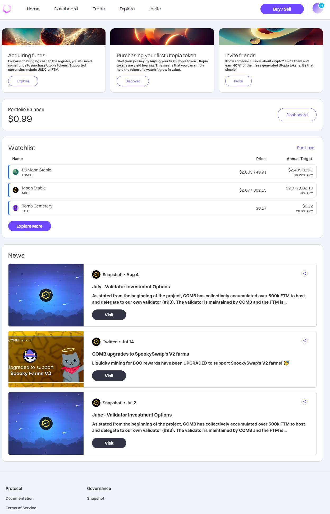

# Step 9: Swap FTM for COMB

Once you receive your FTM tokens in your Metamask wallet (on Fantom Opera Network), you are finally ready to swap FTM for COMB.\
\
In your website browser, go to [https://swap.spiritswap.finance/#/exchange/swap](https://swap.spiritswap.finance/#/exchange/swap)\
\
Click **Connect Wallet** to connect the site to your wallet:

.png>)

Then select **Metamask** on **Connect Walle**t choices:

 (1) (1).png>)

Once you click Metamask on the previous screen, open your Metamask wallet and approve the connection by clicking Next as shown below:

 (1).png>)

Select FTM on the left/top (token to be swapped) and COMB on the right/bottom (token you are swapping into) \
\
Enter either the qty of COMB you want to receive, or the qty of FTM you want to exchange. \
\
Click the Swap Button then approve in MetaMask (NOTE: Leave a small amount of FTM in your wallet (1-2 FTM) to cover future fees)

